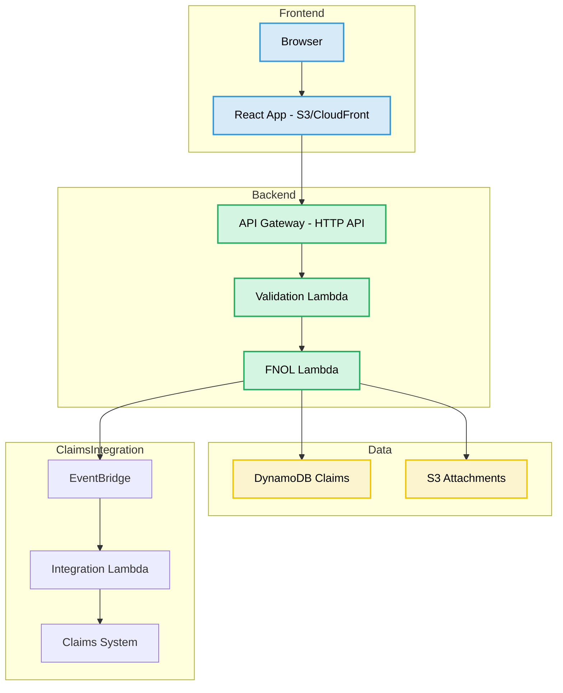

# FNOL Serverless Architecture

```mermaid
flowchart TB
  classDef frontend fill:#D6EAF8,stroke:#3498DB,stroke-width:2px,color:#000;
  classDef backend fill:#D5F5E3,stroke:#27AE60,stroke-width:2px,color:#000;
  classDef database fill:#FCF3CF,stroke:#F1C40F,stroke-width:2px,color:#000;

  %% Frontend
  subgraph Frontend
      A[Browser]
      B[React App - S3/CloudFront]
      A --> B
  end
  class A,B frontend;

  %% Backend
  subgraph Backend
      C[API Gateway - HTTP API]
      V[Validation Lambda]
      D[FNOL Lambda]
      B --> C
      C --> V
      V --> D
  end
  class C,V,D backend;

  %% Data Store
  subgraph Data
      E[DynamoDB Claims]
      F[S3 Attachments]
      D --> E
      D --> F
  end
  class E,F database;

  %% Claims Integration
  subgraph ClaimsIntegration
      G[EventBridge]
      H[Integration Lambda]
      I[Claims System]
      D --> G
      G --> H
      H --> I
  end
```
