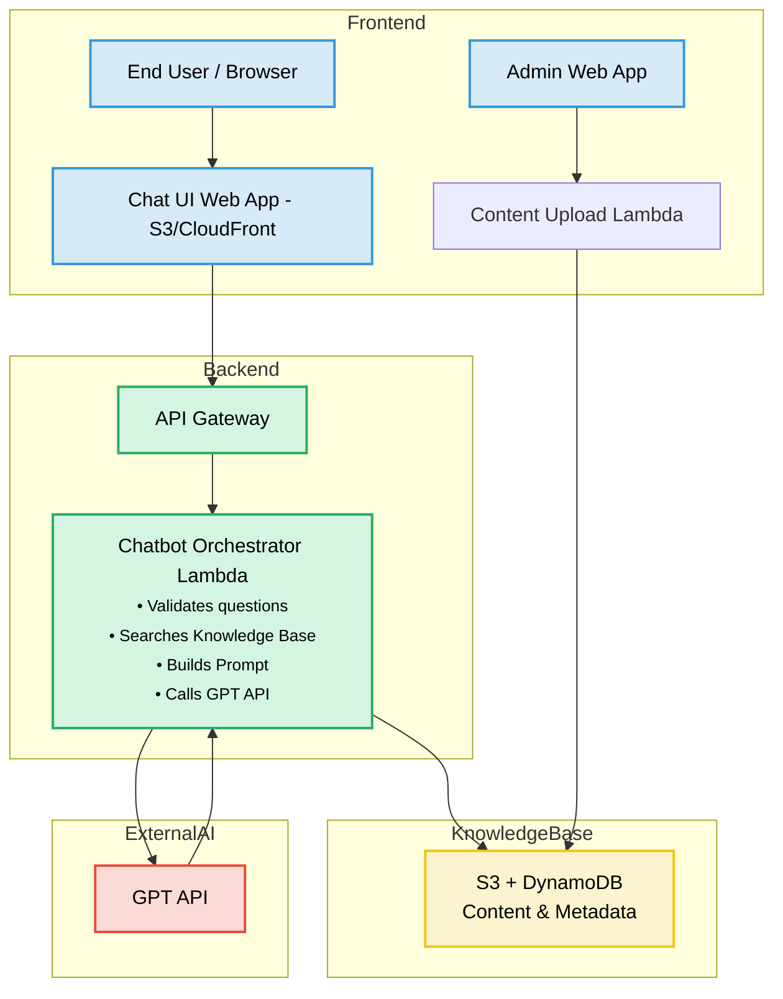

# GPT Chatbot Feature Architecture

```mermaid
flowchart TB
  classDef frontend fill:#D6EAF8,stroke:#3498DB,stroke-width:2px,color:#000;
  classDef backend fill:#D5F5E3,stroke:#27AE60,stroke-width:2px,color:#000;
  classDef database fill:#FCF3CF,stroke:#F1C40F,stroke-width:2px,color:#000;
  classDef external fill:#FADBD8,stroke:#E74C3C,stroke-width:2px,color:#000;

  %% Frontend
  subgraph Frontend
      A[End User / Browser]
      B[Chat UI Web App - S3/CloudFront]
      X[Admin Web App]
      A --> B
      X --> Y[Content Upload Lambda]
  end
  class A,B,X frontend;

  %% Backend
  subgraph Backend
      C[API Gateway]
      D[Chatbot Orchestrator Lambda<br/><small>• Validates questions<br/>• Searches Knowledge Base<br/>• Builds Prompt<br/>• Calls GPT API</small>]
      B --> C
      C --> D
  end
  class C,D backend;

  %% Knowledge Base
  subgraph KnowledgeBase
      E[S3 + DynamoDB<br/>Content & Metadata]
  end
  class E database;

  %% External AI
  subgraph ExternalAI
      F[GPT API]
  end
  class F external;

  %% Flow connections
  D --> E
  D --> F
  F --> D
  Y --> E
```
